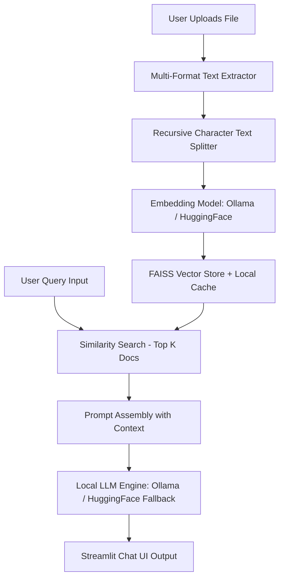

# DocuChat AI — End-to-End Step-by-Step System Architecture & Workflow

DocuChat AI is a local, privacy-first Retrieval-Augmented Generation (RAG) platform. It allows users to upload documents (PDF, DOCX, PPTX, XLSX, TXT) and interactively query them using local Large Language Models (LLMs) and vector embeddings.

---

## 🏗️ High-Level System Architecture



---

## 🔄 Step-by-Step Project Working

### Step 1: User Authentication & Database Setup
- **Component**: SQLite Database (`users.db`) & SQLite functions (`init_db`, `register_user`, `authenticate_user`).
- **Workflow**:
  1. On startup, SQLite initializes the `users` table if it doesn't already exist.
  2. The user registers or signs in using the Streamlit login interface.
  3. Validated sessions set `st.session_state.authenticated = True` and lock vector cache directories to that specific username (`vector_cache/<username>_<hash>`).

---

### Step 2: Document Ingestion & Text Extraction
- **Component**: Multithreaded Extractor (`process_files_parallel`)
- **Supported Formats**:
  - **PDF**: `PyPDF2.PdfReader` extracts text page-by-page.
  - **DOCX**: `python-docx` extracts paragraph text.
  - **PPTX**: `python-pptx` iterates through slides and text shapes.
  - **XLSX**: `pandas` converts Excel sheets into structured text blocks.
  - **TXT**: Direct UTF-8 decoding.
- **Optimization**: Uses Python's `ThreadPoolExecutor(max_workers=4)` to parse multiple uploaded documents in parallel for minimum latency.

---

### Step 3: Text Chunking
- **Component**: `RecursiveCharacterTextSplitter`
- **Workflow**:
  - Raw extracted text is split into overlapping chunks to preserve context across boundaries:
    - **Chunk Size**: `768` characters.
    - **Chunk Overlap**: `100` characters.
  - Overlap ensures sentences spanning two chunks retain semantic clarity during vector indexing.

---

### Step 4: Embedding Generation & FAISS Vector Indexing
- **Component**: `get_embeddings()` & `get_vectorstore(chunks)`
- **Embedding Models**:
  - Primary: Ollama Embeddings (e.g., `nomic-embed-text`).
  - Fallback: HuggingFace sentence-transformers (`all-MiniLM-L6-v2`).
- **Caching Mechanism**:
  - Generates an MD5 hash derived from the embedding model name and chunk contents: `hashlib.md5(...)`.
  - If a cached FAISS index exists on disk (`vector_cache/<username>_<hash>`), it is loaded instantly.
  - If the embedding dimension matches, index creation is skipped (speeding up repeated sessions).
  - Otherwise, FAISS builds a new vector index from texts and saves it locally.

---

### Step 5: Similarity Search & Retrieval
- **Component**: `st.session_state.vectorstore.similarity_search(query, k=3)`
- **Workflow**:
  1. When a user enters a prompt or clicks a suggested question, the query string is converted into a vector embedding using the active model.
  2. FAISS calculates vector distances (L2 distance or cosine similarity) across stored document embeddings.
  3. Returns the top `k=3` most relevant text chunks matching the query topic.

---

### Step 6: Prompt Construction & Local LLM Inference
- **Component**: `handle_query(query)` & `get_llm()`
- **Prompt Format**:
  ```text
  Answer the user query in a natural, friendly, conversational way based strictly on the context below.

  Context:
  <Retrieved Chunk 1>
  <Retrieved Chunk 2>
  <Retrieved Chunk 3>

  Question: <User Query>

  Answer:
  ```
- **Inference Fallback Chain**:
  1. **Ollama**: Connects to `http://localhost:11434` running local models (e.g., `llama3.2`, `mistral`).
  2. **HuggingFace Pipeline (Local CPU/GPU)**: If Ollama is offline, falls back to `Qwen/Qwen2.5-0.5B-Instruct` transformers model.
  3. **Heuristic Summarizer**: If LLM execution fails, falls back to text extraction formatting (`format_human_prose`).

---

### Step 7: UI Rendering & Chat Session State
- **Component**: `chat_interface()` & custom CSS
- **Workflow**:
  - Stores chat history as tuples of `(query, answer)` in `st.session_state.chat_history`.
  - Dynamically renders interactive user and bot chat bubbles with timestamps, user session tags, and active model status pills.
