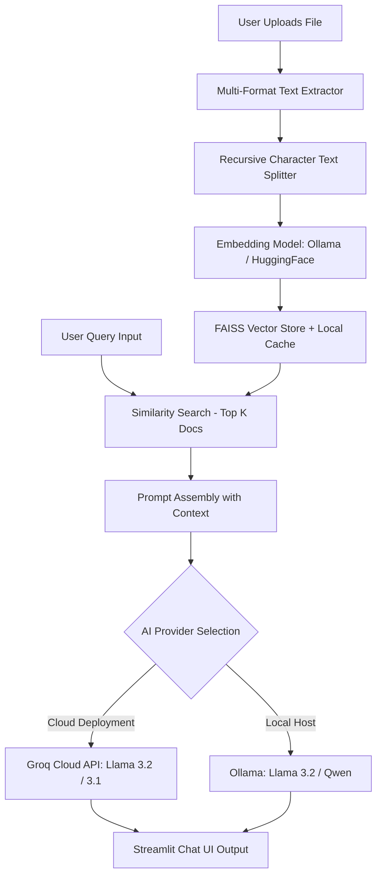

# DocuChat AI — End-to-End System Architecture & Workflow Guide

DocuChat AI is a privacy-first Retrieval-Augmented Generation (RAG) platform supporting both **Local execution (Ollama)** and **Cloud deployment (Groq Cloud API / Streamlit Cloud)**.

---

## 🏗️ High-Level System Architecture

---

## 🔄 Step-by-Step Project Working

### Step 1: User Authentication & Database Setup
- **Component**: SQLite Database (`users.db`) & SQLite functions (`init_db`, `register_user`, `authenticate_user`).
- **Workflow**:
  1. On startup, SQLite initializes the `users` table if it doesn't exist.
  2. The user registers or signs in using the Streamlit login interface.
  3. Validated sessions set `st.session_state.authenticated = True`.

---

### Step 2: Document Ingestion & Text Extraction
- **Component**: Multithreaded Extractor (`process_files_parallel`)
- **Supported Formats**:
  - **PDF**: `PyPDF2.PdfReader`
  - **DOCX**: `python-docx`
  - **PPTX**: `python-pptx`
  - **XLSX**: `pandas`
  - **TXT**: UTF-8 decoding
- **Optimization**: Uses Python's `ThreadPoolExecutor(max_workers=4)` for fast parallel file extraction.

---

### Step 3: Text Chunking
- **Component**: `RecursiveCharacterTextSplitter` (with fallback import compatibility for newer `langchain-text-splitters`).
- **Chunk Parameters**: Size = `768`, Overlap = `100`.

---

### Step 4: Embedding Generation & FAISS Vector Indexing
- **Component**: `get_embeddings()` & `get_vectorstore(chunks)`
- **Embedding Models**:
  - Local/Server: Ollama Embeddings (`nomic-embed-text`).
  - Cloud Fallback: HuggingFace sentence-transformers (`all-MiniLM-L6-v2`).
- **Caching**: MD5 cache derivation saved locally under `vector_cache/`.

---

### Step 5: Similarity Search & Context Retrieval
- **Component**: `st.session_state.vectorstore.similarity_search(query, k=3)`
- **Workflow**: Retrieves the top 3 matching document passages closest in vector distance to the user query.

---

### Step 6: Multi-Provider LLM Inference
- **Component**: `get_llm()` & `handle_query(query)`
- **Providers**:
  1. **Groq Cloud API**: Ultra-fast cloud generation using `llama-3.2-3b-preview` or `llama-3.1-70b-versatile` via `langchain-groq`.
  2. **Ollama**: Connects to `http://localhost:11434` or custom Ollama host URLs.
  3. **Text Summary Fallback**: Renders extracted matching text if no AI provider is configured.

---

## 🌐 Transitioning from Local to Deployed Environment

When moving from a local environment to cloud deployment (e.g. Streamlit Cloud), key adjustments were made:

| Environment Feature | Local Execution | Cloud Deployment (Streamlit Cloud) |
|---|---|---|
| **LLM Inference** | Ollama running on `localhost:11434` | **Groq Cloud API** (`llama-3.2-3b-preview`) |
| **Embeddings** | Ollama (`nomic-embed-text`) or HuggingFace | HuggingFace (`all-MiniLM-L6-v2`) |
| **Dependencies** | Installed locally in `venv` | Explicitly declared in `requirements.txt` (including `langchain-text-splitters`, `langchain-groq`, `transformers`, `torch`) |
| **Database & Cache** | Local `users.db` & `vector_cache/` | Auto-initialized on launch (`.gitignore` excludes local caches) |
